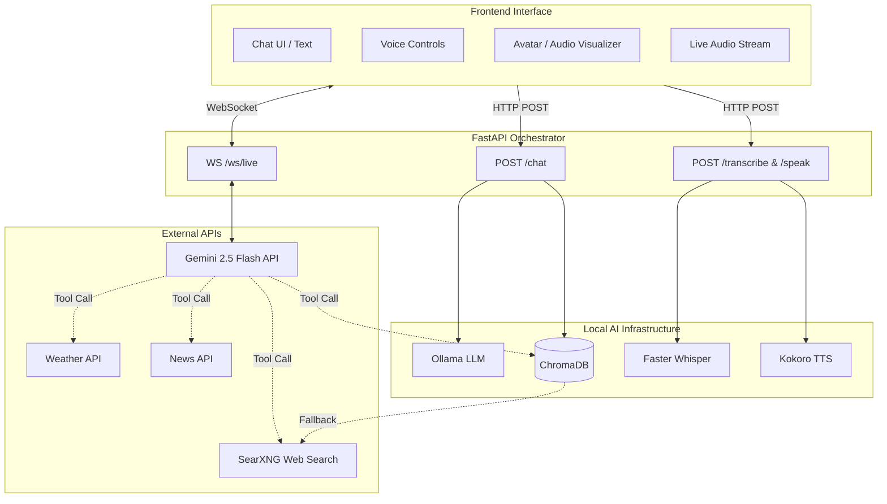

# Local Voice AI Assistant – System Architecture (Updated)

## 1. Project Overview

Local Voice AI Assistant is a hybrid conversational AI platform that combines locally hosted models with powerful cloud-based LLM APIs for real-time capabilities. It integrates:

*   **Retrieval Augmented Generation (RAG)** with fallback to web search.
*   **Local Large Language Models (LLMs)** (via Ollama) for text-based chat.
*   **Real-time Streaming Voice Assistant** (via Gemini 2.5 Flash Native Audio API).
*   **Agentic Tool Calling** (Weather, News, Knowledge Base, Web Search).
*   **Speech-to-Text (STT) and Text-to-Speech (TTS)** (Faster Whisper, Kokoro TTS).
*   **Interactive Web Chat Interface** with real-time audio visualization.

The system is designed to operate with a flexible architecture: leveraging local infrastructure for privacy and cost-savings where possible, while seamlessly integrating external APIs for advanced, low-latency, real-time voice interactions.

---

## 2. High-Level Architecture

---

## 3. Backend Components

### 3.1 FastAPI Service (`main.py`)

FastAPI serves as the central orchestration layer.

**Responsibilities:**
*   Receives standard text messages (`/chat`).
*   Processes audio uploads and TTS generation (`/transcribe`, `/speak`).
*   Manages WebSocket connections for real-time voice streaming (`/ws/live`).
*   Invokes the RAG pipeline and tool modules.
*   Serves the frontend static files.

**Key Endpoints:**

*   `POST /chat`: Standard text chat interaction with local RAG and intent routing (e.g., weather, news, language).
*   `POST /transcribe`: Receives a `.wav` upload and returns transcribed text.
*   `POST /speak`: Receives text and returns a generated `.mp3` audio stream.
*   `WS /ws/live`: Persistent WebSocket connection for the `GeminiLiveSession`.

---

## 4. Agent Tools & Capabilities

The system has evolved to include automated tool calling, heavily utilized by the Gemini Live session and the `/chat` router.

*   **Weather (`weather.py`):** Fetches current weather information for a specified city.
*   **News (`news.py`):** Fetches the latest news articles based on a topic.
*   **Web Search (`search.py`):** Uses SearXNG to fetch live information from the web when the internal knowledge base lacks answers.
*   **Knowledge Base (`rag.py`):** Queries local documents using embeddings.

---

## 5. Retrieval Augmented Generation (RAG) Layer

**Objective:** Provide grounded responses based on local company knowledge, with internet fallback.

**Knowledge Source:**
*   `knowledge/knowledge.txt` (ingested into ChromaDB).

**Embedding Model:** `nomic-embed-text` (via Ollama).
**Vector Database:** `ChromaDB` (`chroma_db` directory).

**RAG Pipeline (`ask_question` / `query_knowledge_base`):**
1.  User question is embedded using `nomic-embed-text`.
2.  Vector search is executed against ChromaDB.
3.  If the best distance score is below the `SIMILARITY_THRESHOLD` (300), the knowledge base context is used.
4.  **Fallback Mechanism:** If the distance exceeds the threshold (no matching local info), the system automatically performs a `search_web` call (SearXNG) to gather context from the internet.
5.  Context is injected into the prompt and sent to the LLM.

---

## 6. Large Language Model (LLM) Layer

The architecture now supports dual inference engines based on the interaction mode.

### Mode 1: Standard Text Chat (Local)
*   **Inference Engine:** Ollama
*   **Model:** `llama3`
*   **Responsibilities:** Prompt execution, local text generation, and handling multi-turn chat history for the `/chat` endpoint.

### Mode 2: Real-time Voice Chat (Cloud)
*   **Inference Engine:** Google GenAI API (`gemini_live.py`)
*   **Model:** `gemini-2.5-flash-native-audio-latest`
*   **Responsibilities:** Low-latency, full-duplex audio streaming, real-time native audio generation, and autonomous tool calling via WebSockets.

---

## 7. Speech-to-Text & Text-to-Speech

### Speech-to-Text (`stt.py`)
*   **Technology:** Faster Whisper
*   **Pipeline:** Audio Upload $\rightarrow$ Faster Whisper $\rightarrow$ Text Query

### Text-to-Speech (`tts.py`)
*   **Technology:** Kokoro TTS
*   **Pipeline:** AI Text Response $\rightarrow$ Kokoro $\rightarrow$ `.mp3` Audio Output

*(Note: The real-time `/ws/live` endpoint bypasses these local services, utilizing Gemini's native audio-in/audio-out capabilities.)*

---

## 8. Frontend Architecture

**Technology:** HTML, Vanilla CSS, Vanilla JavaScript. No heavy frontend frameworks required.

**Key Files:**
*   `index.html` / `script.js` / `styles.css`: Standard text/audio chat UI.
*   `live.html` / `live.js` / `live.css`: Dedicated interface for the real-time Gemini Live WebSocket streaming.

**Features:**
*   Web Audio API for capturing microphone input.
*   WebSockets for streaming PCM audio chunks to/from the backend.
*   Canvas API `AnalyserNode` for dynamic real-time audio visualization.

---

## 9. Design Principles

The platform is designed around a **Hybrid AI Strategy**:

*   **Modularity:** Replaceable components (STT, TTS, Vector DB) remain loosely coupled.
*   **Privacy-First Baseline:** Core RAG data and text chat remain local.
*   **Best-in-Class Voice:** Utilizing state-of-the-art cloud APIs (Gemini) strictly for low-latency, real-time voice interactions where local models currently struggle with speed.
*   **Extensibility:** Simple Python function wrappers allow new tools (e.g., CRM integration, IoT control) to be seamlessly exposed to the AI agent.
